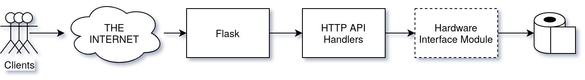

# TPaaS Server

[Introduction](#Introduction)  
[Structure](#Structure)  
[Running](#Running)

---

## Introduction

Hello and welcome to the documentation for the Toilet Paper As A Service Server.
This documentation contains information on the structure, organization, and
operating principles of the TPaaS backend.

## Structure

  
*Dashed outlines indicate components whose designs have not yet been finalized*

## Running

The server requries that the following components be installed on your computer:

* Python 3.7+
* Flask 0.12.5+

To launch the server:

**Linux/Mac:**
```bash
$ cd <project_root>/TPaaS/server
$ ./server.sh
```

**Windows:**
```cmd
> explorer "https://wiki.archlinux.org/index.php/Installation_guide"
```